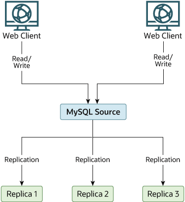
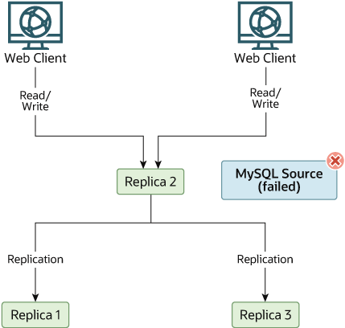

### 19.4.8 在故障转移期间切换源

您可以让副本通过使用 `CHANGE REPLICATION SOURCE TO` 语句（在 MySQL 8.0.23 之前是 `CHANGE MASTER TO`）切换到新的源。副本不会检查源上的数据库是否与副本上的数据库兼容；它只是开始从新源的二进制日志指定坐标读取并执行事件。在故障转移情况下，群组中的所有服务器通常都在执行来自同一二进制日志文件的相同事件，因此改变事件的源不应影响数据库的结构或完整性，前提是您在进行更改时要小心谨慎。

副本应该启用二进制日志记录功能（`--log-bin` 选项），这是默认设置。如果您没有使用 GTID 进行复制，则副本还应该使用 `--log-slave-updates=OFF` 运行（记录副本更新是默认设置）。这样，副本就可以在不重新启动 `mysqld` 的情况下准备好成为源。假设您有如图 19.4 “使用复制实现冗余，初始结构”所示的结构。

**图 19.4 使用复制实现冗余，初始结构**

两个 web 客户端将数据库读写操作都直接指向单个 MySQL 源服务器。MySQL 源服务器复制到副本 1、副本 2 和副本 3。

在这个图中，Source持有源数据库，Replica *主机是副本，Web 客户端机器发出数据库读写请求。只发出读取请求的 Web 客户端（通常连接到副本）没有显示，因为在发生故障时它们不需要切换到新服务器。有关读/写扩展复制结构的更详细示例，请参见第 19.4.5 节，“使用复制进行扩展”。

每个 MySQL 副本（副本 1、副本 2 和副本 3）都是启用了二进制日志记录的副本，并设置 `--log-slave-updates=OFF`。由于当指定 `--log-slave-updates=OFF` 时，副本从源接收的更新不会写入二进制日志，因此每个副本的二进制日志最初是空的。如果由于某种原因源变得不可用，您可以选择一个副本成为新的源。例如，如果您选择副本 1，所有 Web 客户端都应该重定向到副本 1，副本 1 将更新写入其二进制日志。副本 2 和副本 3 然后应该从副本 1 复制。

运行副本时使用 `--log-slave-updates=OFF` 的原因是为了防止在您使其中一个副本成为新的源时，副本接收更新两次。如果副本 1 启用了 `--log-slave-updates`（这是默认设置），它将把从源接收的任何更新都写入自己的二进制日志。这意味着，当副本 2 从源切换到副本 1 作为其源时，它可能会从副本 1 接收已经从源接收过的更新。

确保所有副本都已处理其中继日志中的任何语句。在每个副本上发出 `STOP REPLICA IO_THREAD`，然后检查 `SHOW PROCESSLIST` 的输出，直到您看到已读取所有中继日志。当所有副本都是这种情况时，它们可以重新配置为新的设置。在被提升为源的副本副本 1 上，发出 `STOP REPLICA` 和 `RESET MASTER`。

在其他副本副本 2 和副本 3 上，使用 `STOP REPLICA` 和 `CHANGE REPLICATION SOURCE TO SOURCE_HOST='Replica1'` 或 `CHANGE MASTER TO MASTER_HOST='Replica1'`（其中 'Replica1' 代表副本 1 的真实主机名）。使用 `CHANGE REPLICATION SOURCE TO` 时，添加有关如何从副本 2 或副本 3 连接到副本 1 的所有信息（用户、密码、端口）。在这种情况下发出语句时，无需指定要从中读取的副本 1 二进制日志文件或日志位置，因为第一个二进制日志文件和位置 4 是默认值。最后，在副本 2 和副本 3 上执行 `START REPLICA`。

一旦新的复制设置到位，您需要告诉每个 Web 客户端将其语句定向到副本 1。从那时起，由 Web 客户端发送给副本 1 的所有更新都写入副本 1 的二进制日志，这个日志随后包含自源不可用以来发送给副本 1 的每个更新。

结果服务器结构显示在图 19.5 “使用复制实现冗余，源失败后”。

**图 19.5 使用复制实现冗余，源失败后**

MySQL 源服务器已失败，不再连接到复制拓扑。两个 web 客户端现在将数据库读写操作都直接指向副本 1，这是新的源。副本 1 复制到副本 2 和副本 3。

当源再次可用时，您应该使其成为副本 1 的副本。为此，在源上发出与之前在副本 2 和副本 3 上发出的相同的 `CHANGE REPLICATION SOURCE TO`（或 `CHANGE MASTER TO`）语句。然后源成为副本 1 的副本，并从中捕获在其离线期间错过的 Web 客户端写入。

要使源再次成为源，使用前面的程序，就好像副本 1 不可用而源将成为新的源一样。在此程序中，不要忘记在使副本 1、副本 2 和副本 3 成为源的副本之前在源上运行 `RESET MASTER`。如果您未能这样做，副本可能会捕获 Web 客户端应用程序在源不可用之前的过时写入。

您应该知道，即使副本共享同一个源，它们之间也没有同步，因此一些副本可能远远领先于其他副本。这意味着在某些情况下，上述过程可能无法按预期工作。然而，在实践中，所有副本的中继日志应该相对接近。

保持应用程序了解源位置的一种方法是为源主机设置动态 DNS 条目。使用 BIND 时，您可以使用 `nsupdate` 动态更新 DNS。