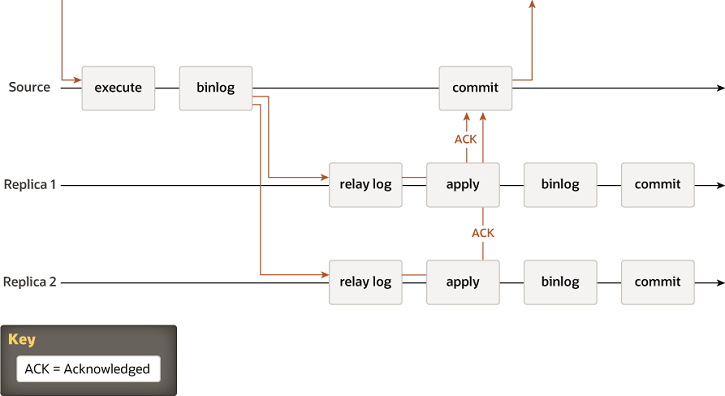

#### 20.1.1.2 组复制

群组复制是一种可用于实现容错系统的技术。复制群组是一组服务器，每个服务器都有自己的数据完整副本（一种无共享复制方案），并通过消息传递相互交互。通信层提供了一系列保证，如原子消息和总体顺序消息传递。这些是非常强大的属性，转化为非常有用的抽象，人们可以利用这些来构建更高级的数据库复制解决方案。

MySQL群组复制建立在这些属性和抽象之上，并实现了一个多源更新的复制协议。一个复制群组由多个服务器组成，群组中的每个服务器可以随时独立执行事务。然而，所有读写事务只有在得到群组批准后才提交。换句话说，对于任何读写事务，群组需要决定它是提交还是不提交，因此提交操作不是来源服务器的单方面决定。只读事务无需在群组内协调，立即提交。

当一个读写事务在来源服务器准备提交时，服务器会原子性地广播写入值（被更改的行）和相应的写入集（被更新的行的唯一标识符）。由于事务通过原子广播发送，所以群组中的所有服务器要么都接收到事务，要么都不接收。如果它们接收到了，那么它们都会按照相对于之前发送的其他事务的相同顺序接收到。因此，所有服务器都以相同的顺序接收到相同的事务集，并为事务建立了一个全球总体顺序。

然而，在不同服务器上同时执行的事务之间可能会发生冲突。通过检查和比较两个不同且同时发生的事务的写入集来检测这种冲突，这个过程称为认证。在认证过程中，冲突检测是在行级别进行的：如果在不同服务器上执行的两个并发事务更新了同一行，则存在冲突。冲突解决程序规定，首先排序的事务在所有服务器上提交，而第二个排序的事务中止，并因此在来源服务器上回滚并被群组中的其他服务器丢弃。例如，如果t1和t2在不同的站点同时执行，都更改了同一行，且t2在t1之前排序，则t2赢得冲突，t1被回滚。这实际上是一个分布式的首次提交胜出规则。请注意，如果两个事务经常发生冲突，那么最好在同一个服务器上启动它们，在那里它们有机会在本地锁管理器上同步，而不是因为认证而被回滚。

为了应用（*applying*）和外化（*externalizing*）经过认证的事务，群组复制允许服务器在不破坏一致性和有效性的情况下偏离事务的约定顺序。群组复制是一个最终一致性系统，意味着一旦进入的流量减缓或停止，所有群组成员都具有相同的数据内容。在流量流动时，事务可以以稍微不同的顺序外化，或者在一些成员上先于其他成员外化。例如，在多主模式下，本地事务可能在认证后立即外化，尽管在全局顺序中较早的远程事务尚未应用。当认证过程确定事务之间没有冲突时，这是被允许的。在单主模式下，在主服务器上，非冲突的并发本地事务可能会以不同于群组复制约定的全局顺序提交和外化。在不接受客户端写入的从属服务器上，事务总是按照约定的顺序提交和外化。

下图描绘了MySQL群组复制协议，并通过将其与MySQL复制（甚至MySQL半同步复制）进行比较，你可以看到一些差异。出于清晰度的考虑，一些底层共识和Paxos相关的消息在这张图中缺失。

