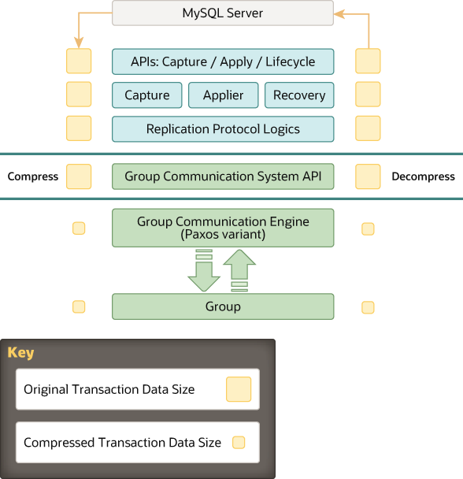

### 20.7.4 消息压缩

对于在线组成员之间发送的消息，组复制默认启用消息压缩。是否压缩特定消息取决于您使用 `group_replication_compression_threshold` 系统变量配置的阈值。负载量大于指定字节数的消息将被压缩。

默认的压缩阈值为 1000000 字节。例如，您可以使用以下语句将压缩阈值增加到 2MB：

```sql
STOP GROUP_REPLICATION;
SET GLOBAL group_replication_compression_threshold = 2097152;
START GROUP_REPLICATION;
```

如果将 `group_replication_compression_threshold` 设置为零，则禁用消息压缩。

组复制使用 LZ4 压缩算法来压缩在组中发送的消息。请注意，LZ4 压缩算法支持的最大输入大小为 2113929216 字节。此限制低于 `group_replication_compression_threshold` 系统变量的最大可能值，后者与 XCom 接受的最大消息大小相匹配。因此，LZ4 的最大输入大小实际上是消息压缩的一个限制，当启用消息压缩时，无法提交超过此大小的事务。使用 LZ4 压缩算法时，不要为 `group_replication_compression_threshold` 设置大于 2113929216 字节的值。

`group_replication_compression_threshold` 的值不要求在所有组成员上相同。但是，为了避免不必要的事务回滚、消息传递失败或消息恢复失败，建议在所有组成员上设置相同的值。

从 MySQL 8.0.18 开始，您还可以为通过捐赠者的二进制日志的状态转移方法发送的分布式恢复消息配置压缩。这些从已经在组中的捐赠者发送到加入成员的消息的压缩是单独控制的，使用`group_replication_recovery_compression_algorithms` 和 `group_replication_recovery_zstd_compression_level` 系统变量。有关更多信息，请参见第 4.2.8 节，“连接压缩控制”。

二进制日志事务压缩（从 MySQL 8.0.20 开始提供），通过 `binlog_transaction_compression` 系统变量激活，也可用于节省带宽。当它们在组成员之间传输时，事务负载保持压缩状态。如果您将二进制日志事务压缩与组复制的消息压缩结合使用，消息压缩对数据的作用机会会减少，但仍然可以压缩头部和那些未压缩的事件和事务负载。有关二进制日志事务压缩的更多信息，请参见第 5.4.4.5 节，“二进制日志事务压缩”。

组中消息的压缩发生在组通信引擎级别，在数据交给组通信线程之前，因此它发生在 mysql 用户会话线程的上下文中。如果消息负载大小超过 `group_replication_compression_threshold` 设置的阈值，则事务负载在发送到组之前被压缩，并在接收时解压缩。接收到消息后，成员检查消息信封以验证它是否被压缩。如果需要，成员会解压缩事务，然后再交付给上层。该过程如下图所示。

图 18.13 压缩支持



MySQL 组复制插件架构如前所述，插件的五层位于 MySQL 服务器和复制组之间。压缩和解压缩由组通信系统 API 处理，这是组复制插件的第四层。组通信引擎（插件的第五层）和组成员使用具有较小数据大小的压缩事务。MySQL 服务器核心和组复制插件的三个高层（API、捕获、应用和恢复组件以及复制协议模块）使用具有较大数据大小的原始事务。

当网络带宽是瓶颈时，消息压缩可以在组通信级别提供高达 30-40% 的吞吐量提升。这在大型服务器组负载的背景下尤为重要。N 个参与者之间的 TCP 点对点互连的性质使发送方发送相同数量的数据 N 次。此外，二进制日志可能表现出高压缩比。这使得对于包含大型事务的组复制工作负载，压缩成为一个引人注目的特性。