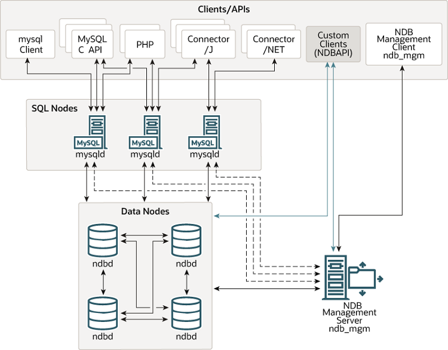

## 25.2 NDB Cluster 概述

- [25.2.1 NDB Cluster 核心概念](./25.02.01.NDB Cluster 核心概念.md)
- [25.2.2 NDB Cluster 节点、节点组、片段副本和分区](./25.02.02.NDB Cluster 节点、节点组、片段副本和分区.md)
- [25.2.3 NDB Cluster 硬件、软件和网络要求](./25.02.03.NDB Cluster 硬件、软件和网络要求.md)
- [25.2.4 MySQL NDB Cluster 8.0 的新功能](./25.02.04.MySQL NDB Cluster 8.0 的新功能.md)
- [25.2.5 在 NDB 8.0 中添加、废弃或移除的选项、变量和参数](./25.02.05.在 NDB 8.0 中添加、废弃或移除的选项、变量和参数.md)
- [25.2.6 使用 InnoDB 的 MySQL Server 与 NDB Cluster 的比较](./25.02.06.使用 InnoDB 的 MySQL Server 与 NDB Cluster 的比较/25.02.06.00.使用 InnoDB 的 MySQL Server 与 NDB Cluster 的比较.md)
- [25.2.7 NDB Cluster 的已知限制](./25.02.07.NDB Cluster 的已知限制/25.02.07.00.NDB Cluster 的已知限制.md)

NDB Cluster 是一种技术，可以在shared-nothing系统中实现内存数据库的集群。shared-nothing架构使系统能够使用非常便宜的硬件，并且对硬件或软件的特定要求最少。

NDB Cluster 设计为没有单点故障。在shared-nothing系统中，每个组件都应具有自己的内存和磁盘，不建议或不支持使用诸如网络共享、网络文件系统和 SAN 等共享存储机制。

NDB Cluster 将标准 MySQL 服务器与称为 NDB（即“网络数据库”）的内存集群存储引擎集成在一起。在我们的文档中，术语 NDB 指的是特定于存储引擎的部分，而“MySQL NDB Cluster”则指的是一个或多个 MySQL 服务器与 NDB 存储引擎的组合。

一个 NDB Cluster 由一组计算机（称为主机）组成，每台主机运行一个或多个进程。这些进程称为节点，可能包括 MySQL 服务器（用于访问 NDB 数据）、数据节点（用于存储数据）、一个或多个管理服务器，以及可能其他专门的数据访问程序。下图显示了 NDB Cluster 中这些组件的关系：

**图 25.1 NDB Cluster 组件**

在此集群中，三个 MySQL 服务器（`mysqld` 程序）是提供对存储数据的四个数据节点（`ndbd` 程序）的访问的 SQL 节点。SQL 节点和数据节点由一个 NDB 管理服务器（`ndb_mgmd` 程序）控制。各种客户端和 API 可以与 SQL 节点交互——`mysql` 客户端、MySQL C API、PHP、Connector/J 和 Connector/NET。还可以使用 NDB API 创建自定义客户端与数据节点或 NDB 管理服务器交互。NDB 管理客户端（`ndb_mgm` 程序）与 NDB 管理服务器交互。

所有这些程序共同工作形成一个 NDB Cluster（参见第 25.5 节，“[NDB Cluster 程序](#ndb-cluster-programs)”）。当数据由 NDB 存储引擎存储时，表（和表数据）存储在数据节点中。这些表可以从集群中的所有其他 MySQL 服务器（SQL 节点）直接访问。因此，在一个将数据存储在集群中的工资应用程序中，如果一个应用程序更新了员工的工资，所有其他查询此数据的 MySQL 服务器可以立即看到此更改。

从 NDB 8.0.31 开始，NDB Cluster 8.0 SQL 节点使用 `mysqld` 服务器守护进程，该守护进程与 MySQL Server 8.0 发行版中提供的 `mysqld` 相同。在 NDB 8.0.30 及之前的版本中，它在许多关键方面与 MySQL Server 提供的 `mysqld` 二进制文件不同，这两个版本的 `mysqld` 不能互换。你应该记住，无论版本如何，如果 `mysqld` 实例未连接到 NDB Cluster，则无法使用 NDB 存储引擎，也无法访问任何 NDB Cluster 数据。

为 NDB Cluster 存储在数据节点中的数据可以被镜像；集群可以处理个别数据节点的故障，除了少量事务由于丢失事务状态而中止外，不会有其他影响。因为事务性应用程序需要处理事务失败，所以这不应成为问题来源。

可以停止和重启单个节点，然后重新加入系统（集群）。滚动重启（依次重启所有节点）用于进行配置更改和软件升级（参见第 25.6.5 节，“[执行 NDB Cluster 的滚动重启](#performing-a-rolling-restart-of-an-ndb-cluster)”）。滚动重启还用作在线添加新数据节点过程的一部分（参见第 25.6.7 节，“[在线添加 NDB Cluster 数据节点](#adding-ndb-cluster-data-nodes-online)”）。有关数据节点的更多信息、它们在 NDB Cluster 中的组织方式以及它们如何处理和存储 NDB Cluster 数据，请参见第 25.2.2 节，“[NDB Cluster 节点、节点组、片段副本和分区](#ndb-cluster-nodes-node-groups-fragment-replicas-and-partitions)”。

可以使用 NDB Cluster 管理客户端中的 NDB 原生功能和 NDB Cluster 发行版中包含的 `ndb_restore` 程序来备份和恢复 NDB Cluster 数据库。有关更多信息，请参见第 25.6.8 节，“[NDB Cluster 的在线备份](#online-backup-of-ndb-cluster)”，和第 25.5.23 节，“[`ndb_restore` — 恢复 NDB Cluster 备份](#ndb_restore-restore-an-ndb-cluster-backup)”。你也可以使用 `mysqldump` 和 MySQL 服务器提供的标准 MySQL 功能执行此目的。有关更多信息，请参见第 6.5.4 节，“[`mysqldump` — 数据库备份程序](#mysqldump-a-database-backup-program)”。

NDB Cluster 节点可以采用不同的传输机制进行节点间通信；在大多数实际部署中，使用标准 100 Mbps 或更快的以太网硬件上的 TCP/IP。