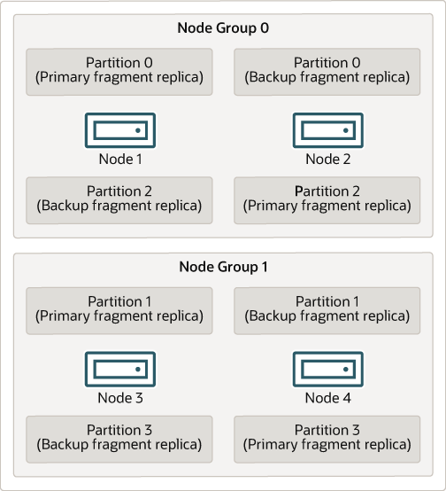
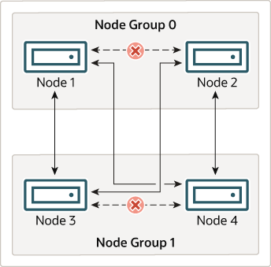

### 25.2.2 NDB Cluster 节点、节点组、片段副本和分区

本节讨论 NDB Cluster 如何划分和复制数据以进行存储。

理解此主题的一些核心概念在接下来的几段中讨论。

**数据节点**。`ndbd` 或 `ndbmtd` 进程，存储一个或多个片段副本——即分配给该节点所属节点组的分区（将在本节后面讨论）的副本。

每个数据节点应位于单独的计算机上。虽然也可以在单个计算机上托管多个数据节点进程，但通常不推荐这种配置。

在引用 `ndbd` 或 `ndbmtd` 进程时，“节点”和“数据节点”这两个术语通常可以互换使用；在讨论中提到管理节点（`ndb_mgmd` 进程）和 SQL 节点（`mysqld` 进程）时，会特别指定。

**节点组**。节点组由一个或多个节点组成，存储分区或片段副本集（见下一个项目）。

NDB Cluster 中节点组的数量不能直接配置；它是数据节点数量和片段副本数量（`NoOfReplicas` 配置参数）的函数，如下所示：

```
[节点组的数量] = [数据节点的数量] / NoOfReplicas
```

因此，如果 `config.ini` 文件中 `NoOfReplicas` 设置为 1，则具有 4 个数据节点的 NDB Cluster 有 4 个节点组；如果 `NoOfReplicas` 设置为 2，则有 2 个节点组；如果 `NoOfReplicas` 设置为 4，则有 1 个节点组。片段副本将在本节后面讨论；有关 `NoOfReplicas` 的更多信息，请参见第 25.4.3.6 节，“[定义 NDB Cluster 数据节点](#defining-ndb-cluster-data-nodes)”。

> **注意**
>
> NDB Cluster 中所有节点组必须具有相同数量的数据节点。

可以在线添加新的节点组（从而添加新的数据节点）到运行中的 NDB Cluster；有关更多信息，请参见第 25.6.7 节，“[在线添加 NDB Cluster 数据节点](#adding-ndb-cluster-data-nodes-online)”。

**分区**。这是集群存储的数据的一部分。每个节点负责保持分配给它的任何分区的至少一个副本（即至少一个片段副本）可供集群使用。

NDB Cluster 默认使用的分区数量取决于数据节点的数量和数据节点使用的 LDM 线程的数量，如下所示：

```
[分区数量] = [数据节点的数量] * [LDM 线程的数量]
```

当使用运行 `ndbmtd` 的数据节点时，LDM 线程的数量由 `MaxNoOfExecutionThreads` 设置控制。当使用 `ndbd` 时，有一个 LDM 线程，这意味着集群的分区数量与参与集群的节点数量相同。这在使用 `ndbmtd` 并将 `MaxNoOfExecutionThreads` 设置为 3 或更少时也是如此。（你应该知道，此参数的值增加时 LDM 线程的数量也会增加，但不是严格的线性关系，而且设置它还有其他限制；有关更多信息，请参见 `MaxNoOfExecutionThreads` 的描述。）

**NDB 和用户定义的分区**。NDB Cluster 通常自动对 NDBCLUSTER 表进行分区。但是，也可以对 NDBCLUSTER 表使用用户定义的分区。这受到以下限制：

- 仅支持 `KEY` 和 `LINEAR KEY` 分区方案在 NDB 表中的生产使用。
- 可以为任何 NDB 表明确定义的最大分区数为 8 * [LDM 线程的数量] * [节点组的数量]，如本节前面所述确定 NDB Cluster 中的节点组数量。当为数据节点进程运行 `ndbd` 时，设置 LDM 线程的数量没有影响（因为 `ThreadConfig` 仅适用于 `ndbmtd`）；在这种情况下，为执行此计算，可以将此值视为等于 1。

有关更多信息，请参见第 25.5.3 节，“[`ndbmtd` — NDB Cluster 数据节点守护进程（多线程）](#ndbmtd-the-ndb-cluster-data-node-daemon-multi-threaded)”。

有关 NDB Cluster 和用户定义分区的更多信息，请参见第 25.2.7 节，“[NDB Cluster 的已知限制](#known-limitations-of-ndb-cluster)”，和第 26.6.2 节，“[与存储引擎相关的分区限制](#partitioning-limitations-relating-to-storage-engines)”。

**片段副本**。这是集群分区的副本。节点组中的每个节点存储一个片段副本。也称为分区副本。片段副本的数量等于每个节点组的节点数量。

片段副本完全属于单个节点；一个节点可以（通常确实）存储多个片段副本。

下图展示了一个具有四个运行 `ndbd` 的数据节点的 NDB Cluster，分为两个节点组，每个节点组有两个节点；节点 1 和 2 属于节点组 0，节点 3 和 4 属于节点组 1。

> **注意**
>
> 此处仅显示数据节点；尽管一个正常运行的 NDB Cluster 需要一个 `ndb_mgmd` 进程来进行集群管理，并且至少需要一个 SQL 节点来访问集群存储的数据，但为了清晰起见，这些未在图中显示。

**图 25.2 两个节点组的 NDB Cluster**



集群存储的数据被分为四个分区，编号为 0、1、2 和 3。每个分区以多个副本存储在同一节点组中。分区按如下方式存储在交替的节点组中：

- 分区 0 存储在节点组 0；一个主片段副本（主副本）存储在节点 1，另一个备份片段副本（分区的备份副本）存储在节点 2。
- 分区 1 存储在另一个节点组（节点组 1）；该分区的主片段副本存储在节点 3，备份片段副本存储在节点 4。
- 分区 2 存储在节点组 0。但其两个片段副本的位置与分区 0 相反；对于分区 2，主片段副本存储在节点 2，备份副本存储在节点 1。
- 分区 3 存储在节点组 1，其两个片段副本的位置与分区 1 相反。即其主片段副本位于节点 4，备份副本位于节点 3。

这意味着关于 NDB Cluster 的持续运行：只要参与集群的每个节点组至少有一个节点在运行，集群就拥有所有数据的完整副本并且保持可用。这在下图中说明。

**图 25.3 2x2 NDB Cluster 所需的节点**



在此示例中，集群由两个节点组组成，每个节点组由两个数据节点组成。每个数据节点运行一个 `ndbd` 实例。来自节点组 0 的至少一个节点和来自节点组 1 的至少一个节点的任何组合都足以保持集群“存活”。但是，如果单个节点组中的两个节点都发生故障，则由另一个节点组中的剩余两个节点组成的组合不足以维持集群。在这种情况下，集群丢失了一个完整的分区，因此无法提供对所有 NDB Cluster 数据的完整访问。

单个 NDB Cluster 实例支持的最大节点组数量为 48。